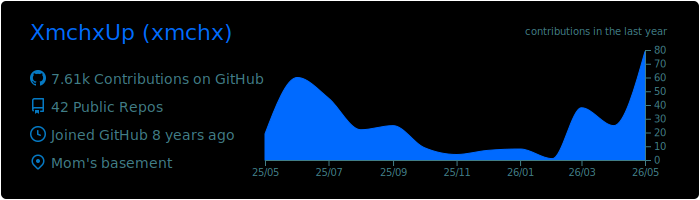
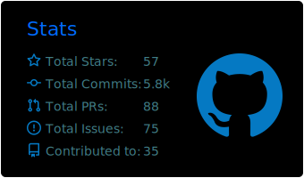
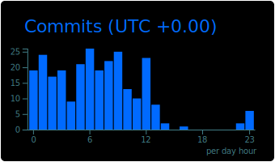
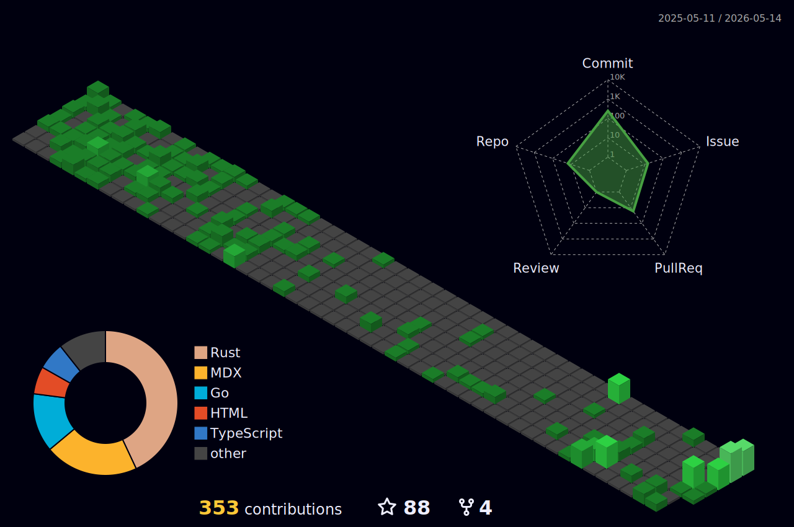

  <h1>XmchxUp</h1>
  
Lifelong learner and hobbyist developer.

  

    
  

## Weekly Coding Activity

<!--START_SECTION:waka-->

<!--END_SECTION:waka-->

## GitHub Metrics

<table align="center">
  <tr>
    <td width="50%">
      
    </td>
    <td width="50%">
      
      
    </td>
  </tr>
</table>

## Summary Cards

  
  

  
  

  <i>You can learn anything.</i>

